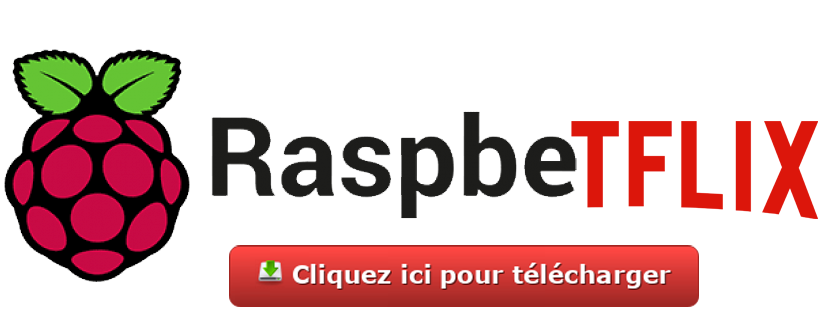

# Avoir un « Netflix » perso pour regarder ses films & séries
## Voir vos films, vos séries et écoutez vos musiques téléchargés sur une interface propre et structurées pour ~50 euros
Avec Raspbeflix vous installerez de façon automatisée sur un Raspberry Pi (un micro ordinateur) :
- Un serveur Plex contenant tous vos films, séries, musiques, photos dans une interface propre et ergonomique. Plex ira récupérer les jaquettes et résumés des films/séries et proposera des filtres, des tris pour les retrouver facilement.
- Un client web pour télécharger des torrents sur le Raspberry Pi depuis n’importe quel ordinateur.
- [en cours de développement] Une connexion VPN sur le Raspberry Pi pour protéger vos connexions.

## Matériel nécessaire

- Une box fonctionnelle connectée à Internet avec un port Ethernet disponible pour le Raspberry Pi

- Un Raspberry Pi 3 (ou plus)

    - Le Raspberry Pi 3 Model B est conseillé, c’est celui qui est utilisé par Raspbetflix : [https://www.amazon.fr/...](https://www.amazon.fr/dp/B01CD5VC92/ref=pe_386181_40444391_TE_item)
    - Je vous propose aussi de prendre ce kit : [https://www.amazon.fr/...](https://www.amazon.fr/dp/B01DDFFOYK/ref=pe_386181_40444391_TE_item) avec prise secteur, coque de protection et dissipateurs de chaleur
- Un cable Ethernet
- Un ordinateur MacOS, Linux ou Windows connecté sur le même réseau que le Raspberry Pi
- Une carte MicroSD de 16Go minimum : [https://www.amazon.fr/...](https://www.amazon.fr/gp/product/B073K14CVB/ref=ppx_yo_dt_b_asin_title_o00_s00?ie=UTF8&psc=1)
- Une TV intelligente sur laquelle il est possible d'installer un client Plex (disponible sur la plupart des TV récentes: Samsung, Android TV, …), un téléphone avec l'App Plex si vous voulez regarder vos films sur Smartphone ou même sur votre ordinateur.
- Un disque dur externe (1T conseillé ou plus) pouvant stocker les fichiers que vous allez exposer sur Plex
  
  
# Installer Raspbetflix sur le Raspberry Pi
Vous avez votre Raspberry Pi et votre carte SD (supérieur à 15Go de stockage), très bien. Pour le début de ce guide, nous allons voir comment installer notre image pré-configurée sur votre carte SD.

## Installer Raspbetflix à partir d’une carte SD vierge

### Etape 1 : Télécharger la dernière version de Raspbetflix
Vous pouvez trouver l’image en haut de cette page, en cliquant sur "Cliquez ici pour télécharger" ou bien en cliquant sur ce lien directement: [https://drive.google.com/file/d/1Lw3pcb1qd_FrZ6Plh-j7mc0RLKXs96OM/view?usp=sharing](https://drive.google.com/file/d/1Lw3pcb1qd_FrZ6Plh-j7mc0RLKXs96OM/view?usp=sharing). Le .zip fait environ 2Go et contient une image .iso de ~15 Go.

### Etape 2 : Décompressez l’archive
Décompressez l’archive que vous venez de télécharger. Vous allez avoir besoin d’un logiciel pour pouvoir décompresser le fichier :

- Windows : 7-Zip
- Mac : The Unarchiver
- Linux : Unzip

### Etape 3 : Téléchargez Etcher
Etcher est un logiciel qui va permettre d’installer Raspbetflix (ou n’importe quel système d’exploitation) sur la carte SD et de le rendre directement bootable.

Il existe d’autres logiciels mais Etcher a l’avantage d’être compatible avec Mac, Windows, Linux et est recommandé par la fondation Raspberry Pi.

Vous pouvez télécharger Etcher ici : [https://www.balena.io/etcher/](https://www.balena.io/etcher/).

### Etape 4 : Insérez votre carte SD dans votre ordinateur et lancez Etcher

### Etape 5 : Flasher la carte SD avec Raspbetflix
Choisir l’image disque de Raspbetflix dans Etcher, sélectionner votre carte SD et lancer l’écriture en cliquant sur « Flash »

Monter l’image de Raspbian sur votre carte SD grâce à Etcher

Plus qu’à attendre !

Une fois terminé vous pouvez insérer la carte SD sur la carte Raspberry Pi, brancher le cable Ethernet de votre Raspberry à votre de box internet et l’alimentation pour démarrer la carte. Attendez une dizaine de minutes et rendez vous sur : [https://app-38ba6f2f-f09b-4b49-982e-947344e0205c.cleverapps.io/](https://app-38ba6f2f-f09b-4b49-982e-947344e0205c.cleverapps.io/).
