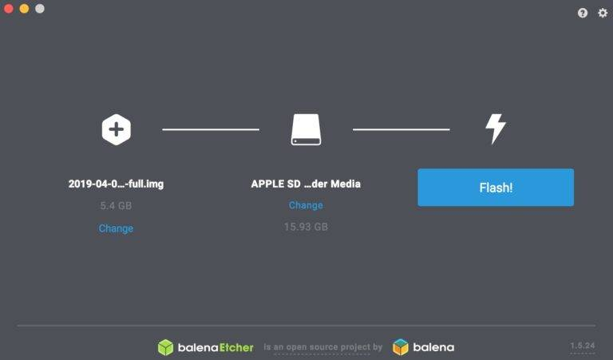

# Installer Raspbetflix sur le Raspberry Pi
Vous avez votre Raspberry Pi et votre carte SD (supérieur à 15Go de stockage), très bien. Pour le début de ce guide, nous allons voir comment installer notre image pré-configurée sur votre carte SD.

## Installer Raspbetflix à partir d’une carte SD vierge

### Etape 1 : Télécharger la dernière version de Raspbetflix
Vous pouvez trouver l’image en haut de cette page, en cliquant sur "Cliquez ici pour télécharger" ou bien en cliquant sur ce lien directement: [https://drive.google.com/file/d/1Lw3pcb1qd_FrZ6Plh-j7mc0RLKXs96OM/view?usp=sharing](https://drive.google.com/file/d/1Lw3pcb1qd_FrZ6Plh-j7mc0RLKXs96OM/view?usp=sharing). Le .zip fait environ 2Go et contient une image .iso de ~15 Go.

### Etape 2 : Décompressez l’archive
Décompressez l’archive que vous venez de télécharger. Vous allez avoir besoin d’un logiciel pour pouvoir décompresser le fichier :

- Windows : 7-Zip
- Mac : The Unarchiver
- Linux : Unzip

### Etape 3 : Téléchargez Etcher
Etcher est un logiciel qui va permettre d’installer Raspbetflix (ou n’importe quel système d’exploitation) sur la carte SD et de le rendre directement bootable.

Il existe d’autres logiciels mais Etcher a l’avantage d’être compatible avec Mac, Windows, Linux et est recommandé par la fondation Raspberry Pi.

Vous pouvez télécharger Etcher ici : [https://www.balena.io/etcher/](https://www.balena.io/etcher/).

### Etape 4 : Insérez votre carte SD dans votre ordinateur et lancez Etcher

### Etape 5 : Flasher la carte SD avec Raspbetflix
Choisir l’image disque de Raspbetflix dans Etcher, sélectionner votre carte SD et lancer l’écriture en cliquant sur « Flash »

Monter l’image de Raspbian sur votre carte SD grâce à Etcher

Plus qu’à attendre !

Une fois terminé vous pouvez insérer la carte SD sur la carte Raspberry Pi, brancher le cable Ethernet de votre Raspberry à votre de box internet et l’alimentation pour démarrer la carte. Attendez une dizaine de minutes et rendez vous sur : [https://app-38ba6f2f-f09b-4b49-982e-947344e0205c.cleverapps.io/](https://app-38ba6f2f-f09b-4b49-982e-947344e0205c.cleverapps.io/).
